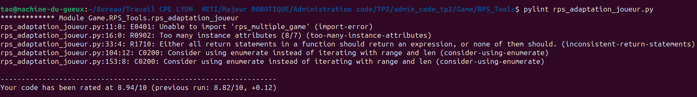
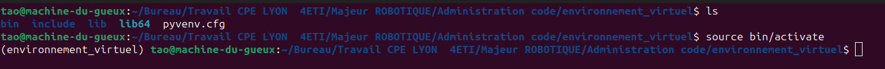
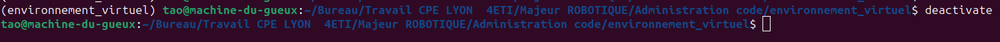
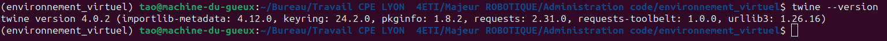
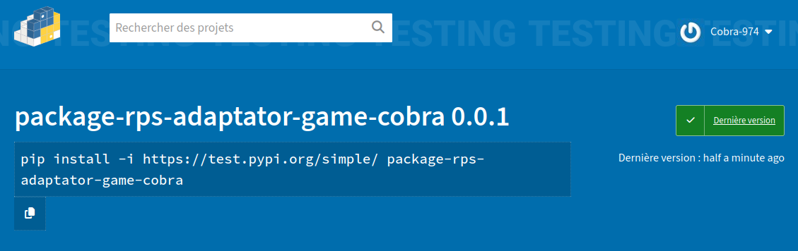

# SUJET_4ETI_AdmCO_TP2_PEINADO

# I. Objectif

Le but de ce TP est de créer un jeu Pierre-Papier-Ciseaux et d'implémenter différentes classes pour permettre à l'utilisateur de jouer selon différents mode de jeu (deux joueurs ou bien un joueur contre une machine. De plus on devait implémenter une stratégie pour que la machine utilise la sauvegarde du score des joueurs et puisse faire ses choix de jeu en fonction de cet historique des parties.
Enfin, ce TP avait pour but de consolider l'utilisation des bonnes pratiques pour la gestion d'un projet ainsi que la recherche de solution à un problème donné.

## II. Organisation du projet

Le projet se présente comme ceci (fonctionnalité 3) :

```
.
├── __init__.py
├── rps_game.py
└── RPS_Tools
    ├── __init__.py
    ├── rps_adaptation_joueur.py
    ├── rps_multiple_game.py
    ├── rps_simple_game.py
    └── tests.py
```
1) Le package `Game` :

Contient une classe `RpsGame` qui implémente les règles du jeu Pierre/Feuille/Ciseaux, ce package contient un sous package `RPS_Tools`

La classe et son constructeur se présente comme ceci :

```
class RpsGame:
    """Classe rps_game."""

    def __init__(self):
        """Constructeur de la classe rps_game."""
        self.resultat = 0
```
La classe contient la méthode `play_rps` permettant de lancer une partie, en effet on exécute une boucle infinie pour lancer le jeu, on met en entrée de la méthode le choix de jeu des joueur 1 et joueur 2.

1) Le package `RPS_Tools` :

Ce package contient un certains nombre de classe :

1) `rps_adaptation_joueur.py`: est une classe qui permet à la machine de faire un choix de jeu (S,P,R) en fonction de l'historique des parties jouées. 
2) `rps_multiple_game.py`: est une classe qui permet à l'utilisateur de lancer une partie contre la machine et de stocker l'historique des parties dans un fichier.
3) `rps_simple_game.py`: est une classe qui permet à l'utilisateur de choisir le mode de jeu qu'il souhaite, soit une partie à deux joueurs ou bien une partie 1 joueur contre la machine.
3) `rps_simple_game.py`: est une classe qui permet de tester les classes précédentes (vérification du bon fonctionnement).

Précisions sur le programme `test.py`:

Ci-dessous un extrait du code de la classe `MyTestCase` :

```
class MyTestCase(unittest.TestCase):
    """Classe permettant de tester la classe RpsSimpleGame."""

    def test_recuperation_des_lignes(self):
        """Classe permettant de tester la méthode lancer_partie de la classe AdaptatorRps."""

        # on supprime le fichier pour tester le fonctionnement
        os.remove("score.txt")
        logger.info("fichier supprimé")
        fichier = "score.txt"
        test = AdaptatorRps()
        test.recuperation_des_lignes(fichier)

        # test si le choix par defaut machine = R
        resultat1 = self.assertEqual("R", test.choix_machine)
        logger.info("Test valeur par défaut machine OK")
```
Pour réaliser ces tests on utilise plusieurs librairies :

a) Librairie unittest :

Cette librairie permet d'automatiser des tests, pour l'utiliser on créer une classe et à chaque méthode on définit des tests spécifiques.
Pour utiliser cette librairie : ```import unittest ```

b) Librairie logging :

Cette librairie permet de dialoguer avec l'utilisateur avec des messages d'informations, d'erreurs, et permet de gérer des logs.
Pour utiliser cette librairie : ```import unittest ```

c) Librairie os :

Cette librairie permet de fournir des fonctions pour interagir avec le système d'exploitation, dans notre cas on se sert de cette librairie pour supprimer un fichier avant l'exécution des tests.

## III. Importations et PYTHONPATH

Pour utiliser les classes de test et créer des objets d'autres classes il faut importer les classes correspondantes :

Utiliser soit ```import RpsGame ``` ou bien ```from rps_game import RpsGame```

Pour gérer le pythonpath on peut ajouter le chemin du package que l'on souhaite importer directement dans le fichier python path (procédure pour linux): 

Ouvrir le fichier ~/.bashrc et rajouter la ligne suivante :
```
export PYTHONPATH=/chemin_absolu_du_package
```
Sauvegarder le fichier.

## VI. Applications des bonnes pratiques

1) Pep 8 et Pep 20

Ce projet a été codé en respectant un maximum les règles de bonnes pratiques pep8 et pep20 du langage Python:

Ces règles et leurs utilisations dans le projet ont été détaillés ici : https://gitlab.com/administration-code-2024/exercice-3.git

2) De plus dans l'optique d'améliorer la lisibilité du code, on utilise les programmes black et pylint : (voir installation de ces librairies dans la section "Librairies nécessaires").

a) black : formate le code qu'on lui donne en argument

Utilisation => ```black mon_fichier.py```

Exemple d'affichage de ce programme :
```
reformatted rps_adaptation_joueur.py

All done! ✨ 🍰 ✨
1 file reformatted.
```
b) pylint : est un analyseur de code qui permet d'attribuer une note allant de [-10,10] pour le code qu'on lui donne en paramètre en fonction de ses critères de bonnes pratiques/lisibilité du code.

Utilisation => ```pylint mon_fichier.py```

Exemple d'affichage de ce programme :



## V. Environnement virtuel

Pour ce projet avec l'utilisation de bibliothèques diverses, on souhaite que les fichiers de librairies reste dans le même emplacement, c'est pourquoi on utilise un environnement virtuel :
Pour créer un environnement virtuel avec venv :

1) ```python -m venv <environment name>``` # permet de créer un environnement virtuel
2) ```source env/bin/activate``` # pour activer l'environnement virtuel



3) Pour quitter l'environnement virtuel ```deactivate```



## VI. Librairies nécessaires

Lancer un environnement virtuel (cf section "Environnement virtuel") pour y installer les librairies nécessaires au projet.

Pour installer pip : ```sudo apt install pip```

Pour la partie test :

La librairie unittest est déjà inclue dans python.
Pour installer logging : ```pip install logging```

Pour les bonnes pratiques :

Pour installer pylint : ```pip install pylint```
Pour installer black : ```pip install black```

## VII. Envoi de la partie fonctionnelle en ligne sur le site https://test.pypi.org/

(Procédure adaptée pour un système linux (ubuntu))

```
1) Créer un compte sur https://test.pypi.org/
2) Activer la double authentification.
3) Créer un token pour s'identifier, pour envoyer des codes sur le site.
5) Activer un environnement virtuel
4) sudo apt install python3-wheel python3-setuptools
5) python3 setup.py sdist bdist_wheel 
6) Installer pip (si ce n'est pas déjà fait)
6) pip3 install twine
7) (twine upload dist/calculator-cobra-0.0.1.tar.gz -r pypi) cette commande me retournait erreur HTTPS donc j'ai utilisée la commande suivante :
twine upload -u YOUR-USERNAME -p YOUR-PASSWORD --repository-url https://test.pypi.org/legacy/ dist/*
pour se connecter avec un token mettre pour le paramètre u:  __token__ et pour le mdp = votre token
```
Ci-contre on voit que twine est bien installé :



# VIII. Récupération du projet en ligne

Pour rendre accessible la partie fonctionnelle du projet (la classe qui réalise les opérations), on le met sur le site https://test.pypi.org/ (cf section précédente) on peut le récupérer avec la commande suivante :

```
pip install -i https://test.pypi.org/simple/ package-rps-adaptator-game-cobra
```
Ci-dessous on peut voir que le fichier a bien été mis en ligne sur le site :



# IX. Gestion des branches dans ce projet

Dans ce projet, on a utilisé une branche main pour avoir la dernière version du code (fonctionnalité 3) et d'autres branches :

Les branches fonctionnalite/numero => permettent de stocker le code fonctionnelle avant la génération du fichier whl (pour plus de compréhension des différentes étapes).
Les branches fonctionnalite/numero_whl => permettent de stocker la génération des fichiers ayant permis à stocker le whl.

# X. Liens vers gitlab

Le projet a été fait en trois grandes étapes qui correspondent aux fonctionnalités demandées (dans les différentes branches).
Dans chaque exercice un REAME.txt a été fait expliquant en détail les objectifs et le code utilisé.
Tout le projet a été fait dans un seul dossier.

Fonctionnalités 1,2,3 : https://gitlab.com/admin_code_tp2/admin_code_tp2.git

# XI. Ressources

Le sujet du TP2 : https://github.com/fabricejumel/SUJET_PARTIE2_4ETI_AdmCO_20232024

Plateforme de mise en ligne de package Python : https://test.pypi.org/

Python path : https://bic-berkeley.github.io/psych-214-fall-2016/using_pythonpath.html

La règle pep20 : https://realpython.com/zen-of-python/

Documentation sur test.pypi : https://packaging.python.org/en/latest/guides/using-testpypi/
et https://blog.kulakowski.fr/post/uploader-un-package-sur-pypi

Intégration continue de gitlab : https://galadrim.fr/blog/comment-utiliser-gitlab-ci-cd-pour-ameliorer-votre-flow-de-developpement

Pour des questions diverses notamment la gestion des fichiers avec Python : chat.openai.com

